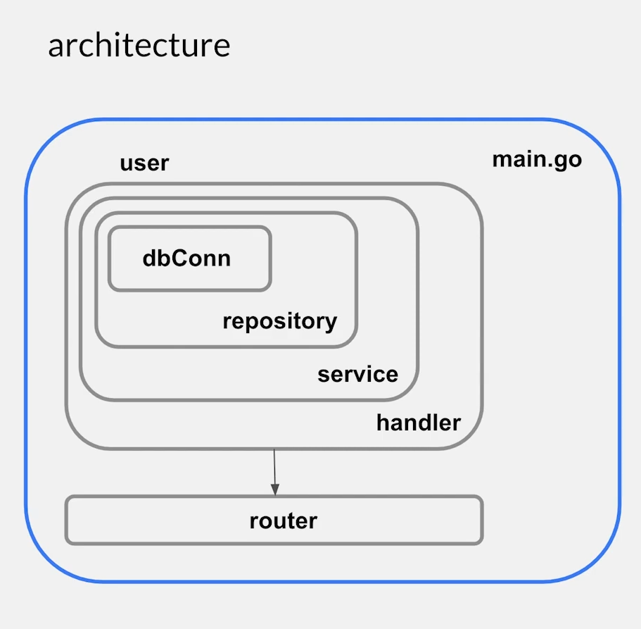
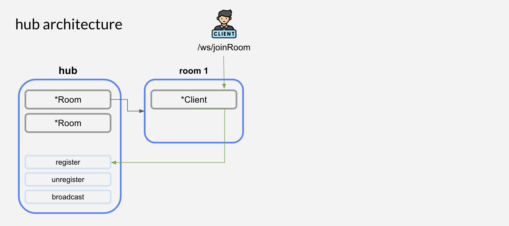
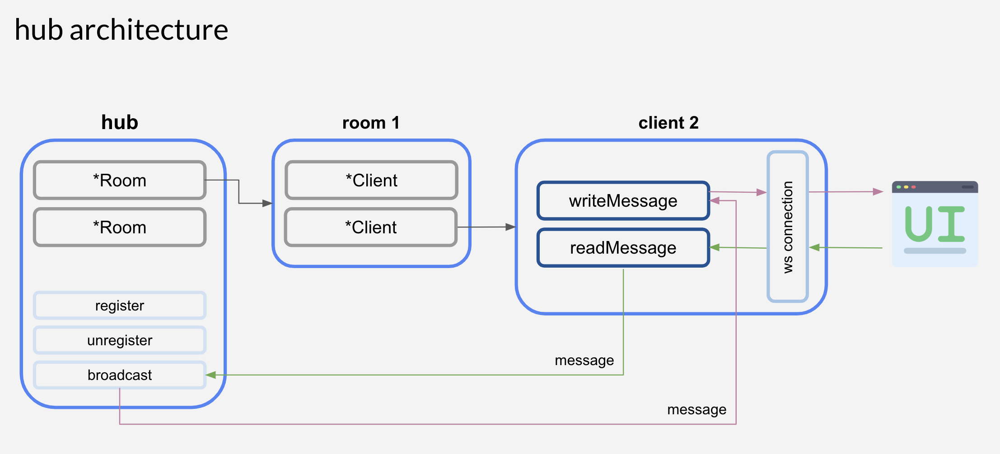

# Golang Chat

Final Project Mata Kuliah Pemrograman Berbasis Kerangka Kerja

## Architecture

1. Domain Driven Design

   

2. Hub

   
   

## How to use

Requirements: Go, Node, PostgreSQL

1. Clone the project

   ```bash
   git clone https://github.com/firaniaputri23/GolangFInalProject.git
   ```

2. Run the server

   ```bash
   cd server
   go run cmd/main.go
   ```

3. Run the client with another terminal

   ```bash
   cd client
   npm run dev
   ```

4. Access `http://localhost:3000` with your browser

